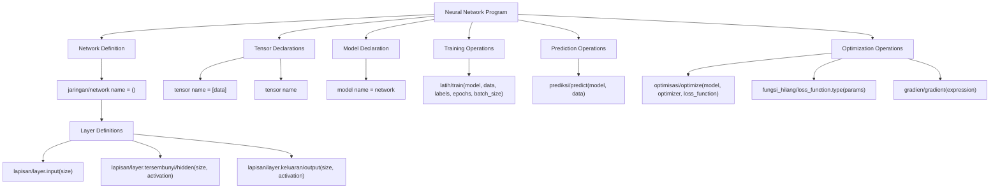

# Neural Networks Syntax Diagram

```mermaid
graph TD
    A[Neural Network Program] --> B[Network Definition]
    A --> C[Tensor Declarations]
    A --> D[Model Declaration]
    A --> E[Training Operations]
    A --> F[Prediction Operations]
    A --> G[Optimization Operations]

    B --> B1["jaringan/network name = ()"]

    C --> C1["tensor name = [data]"]
    C --> C2["tensor name"]

    D --> D1["model name = network"]

    E --> E1["latih/train(model, data, labels, epochs, batch_size)"]

    F --> F1["prediksi/predict(model, data)"]

    G --> G1["optimisasi/optimize(model, optimizer, loss_function)"]
    G --> G2["fungsi_hilang/loss_function.type(params)"]
    G --> G3["gradien/gradient(expression)"]

    B1 --> H[Layer Definitions]
    H --> H1["lapisan/layer.input(size)"]
    H --> H2["lapisan/layer.tersembunyi/hidden(size, activation)"]
    H --> H3["lapisan/layer.keluaran/output(size, activation)"]
```
